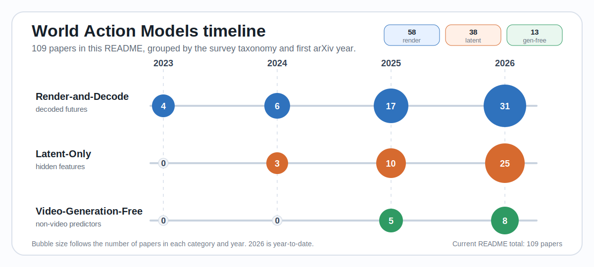

<div align="center">

<h1>World Action Models: A Survey</h1>
<p><em>Dream Less, Act More</em></p>

<p><strong>Qiuhong Shen, Shihua Zhang, Yue Liao, Qi Li, Zhenxiong Tan, Shizun Wang,<br>Shuicheng Yan, Xinchao Wang</strong></p>
<p><em>National University of Singapore</em></p>

<p>
  <a href="https://world-action-models.github.io/"></a>
  <a href="https://world-action-models.github.io/wam-survey-nus.pdf"></a>
</p>

<p>
  <a href="https://www.preprints.org/manuscript/202606.1403/v1"></a>
</p>

<p>
  <strong><a href="https://github.com/world-action-models/awesome-world-action-models/discussions">GitHub Discussions are open</a></strong>
</p>

</div>

---

## Catalog

- **[Community Discussions](#community-discussions)**
- [Survey Highlights](#survey-highlights)
- [Timeline At A Glance](#timeline-at-a-glance)
- [How To Use This List](#how-to-use-this-list)
- [Render-and-Decode](#render-and-decode) (58)
- [Latent-Only](#latent-only) (38)
- [Video-Generation-Free](#video-generation-free) (13)
- **[Contributing](#contributing) — add or update a WAM paper**
- [Citation](#citation)
- [Related Resources](#related-resources)

## Community Discussions

We have opened GitHub Discussions for questions, paper suggestions, taxonomy placement, and community updates.

- **General discussion:** https://github.com/world-action-models/awesome-world-action-models/discussions
- **WeChat group:** https://github.com/world-action-models/awesome-world-action-models/discussions/2

## Survey Highlights

- **The rule is simple:** a model is a WAM when its predicted future is used by the action path. The future may help produce, score, train, or check actions.
- **The survey uses two views.** One view asks what the method predicts. The other breaks each method into substrate, backbone, action coupling, and deployment style.
- **The list has three families:** **Render-and-Decode** (58), **Latent-Only** (38), and **Video-Generation-Free** (13).
- **The trend is easy to see:** newer methods often generate less of the future when control does not need full video. The ⚡ mark highlights papers with an explicit speed, memory, or data-efficiency move.
- **The paper connects the list to broader questions** about interaction, causality, persistence, physical plausibility, data, evaluation, and open challenges.

## Timeline At A Glance

<p align="center">
  
</p>

The figure counts papers in this README by first arXiv year. The 2026 count is year-to-date.

## How To Use This List

Papers are grouped by the survey's three families and listed by first arXiv month. The columns expose the main comparison points used in the survey.

| Column | Meaning |
|:---|:---|
| **Date** | First arXiv submission month (`YYYY-MM`). |
| **Paper** | Title linked to arXiv. ⚡ marks an explicit speed, memory, or data-efficiency move. |
| **Backbone** | The main video, language, vision-language, or policy model used by the method. |
| **Substrate** | What the method predicts: pixels, features, geometry, affordance maps, audio, tokens, and related forms. |
| **TL;DR** | One-line summary of the method. |

### At a glance

| Family | Papers | What it predicts |
|:---|:---:|:---|
| [Render-and-Decode](#render-and-decode) | 58 | A visible or rendered future, such as RGB video, RGB-D, or multi-view frames. |
| [Latent-Only](#latent-only) | 38 | A hidden future representation, such as denoising features, teacher embeddings, flow, masks, or value maps. |
| [Video-Generation-Free](#video-generation-free) | 13 | A non-video predictive signal from an LLM, VLM, diffusion policy, JEPA / DINO model, audio model, or geometric predictor. |
| **Total** | **109** | ⚡ 27 papers carry an explicit efficiency move |

## Render-and-Decode

These methods produce a visible or otherwise rendered future, such as RGB video, RGB-D, or multi-view frames. The action module then reads, tracks, or inverts that future.

| Date | Paper | Backbone | Substrate | TL;DR |
|:---|:---|:---|:---|:---|
| 2023-01 | [Learning Universal Policies via Text-Guided Video Generation (UniPi)](https://arxiv.org/abs/2302.00111) | Video U-Net | Pixel (decoded) | Casts control as text→video generation: synthesize future frames, extract actions via inverse dynamics — the founding video-WAM. |
| 2023-10 | [Learning to Act from Actionless Videos through Dense Correspondences (AVDC)](https://arxiv.org/abs/2310.08576) | Video U-Net | Pixel (decoded) | Hallucinates execution video, derives closed-form actions from dense inter-frame correspondences — no action labels. |
| 2023-10 | [Video Language Planning (VLP)](https://arxiv.org/abs/2310.10625) | Video U-Net + PaLM-E | Pixel (decoded) | Tree-search over a VLM (policy/value) + text→video dynamics model produces long-horizon multimodal video plans. |
| 2023-12 | [Unleashing Large-Scale Video Generative Pre-training for Robot Manipulation (GR-1)](https://arxiv.org/abs/2312.13139) | GPT-style (video-gen pretrain) | Pixel (latent) | Video-generative-pretrained GPT-style transformer predicts future images + actions end-to-end; strong zero-shot transfer. |
| 2024-06 | [Dreamitate: Real-World Visuomotor Policy Learning via Video Generation](https://arxiv.org/abs/2406.16862) | Stereo Video U-Net | Pixel (decoded) | Fine-tunes video diffusion on human tool-use; generated test-time video + tool pose tracking controls the robot. |
| 2024-07 | [This&That: Language-Gesture Controlled Video Generation for Robot Planning](https://arxiv.org/abs/2407.05530) | Video U-Net | Pixel (decoded) | Language+gesture-conditioned video prediction → behavior-cloning Diffusion-Video-to-Action policy. |
| 2024-08 | [GR-MG: Multi-Modal Goal-Conditioned Policy from Partially-Annotated Data](https://arxiv.org/abs/2408.14368) | GPT-style + InstructPix2Pix | Pixel (decoded) | Diffusion image-editing generates a progress-aware goal image; policy conditions on text + generated goal. |
| 2024-09 | [Gen2Act: Human Video Generation in Novel Scenarios](https://arxiv.org/abs/2409.16283) | VideoPoet (frozen) | Pixel (decoded) | Zero-shot human video generation + a single policy conditioned on it → unseen objects/motions. |
| 2024-10 | [GR-2: Generative Video-Language-Action Model with Web-Scale Knowledge](https://arxiv.org/abs/2410.06158) | GPT-style (VQGAN video) | Pixel (latent) | Web-video pretrained, fine-tuned for video generation + action; 97.7% over 100+ tasks, scales with size. |
| 2024-11 | [Prediction with Action: Visual Policy via Joint Denoising (PAD)](https://arxiv.org/abs/2411.18179) | ImageNet DiT | Pixel (latent) | A single DiT jointly denoises future images + actions; co-trains on robot demos + large video. |
| 2025-03 | [CoT-VLA: Visual Chain-of-Thought Reasoning for VLA Models](https://arxiv.org/abs/2503.22020) | VILA-U | Feature (VLM token) | Autoregressively generates future image frames as visual goals, then a short action sequence to reach them. |
| 2025-04 | [TesserAct: Learning 4D Embodied World Models](https://arxiv.org/abs/2504.20995) | CogVideoX (DiT) | Geometric | Generates joint RGB-D-Normal 4D video → high-quality 4D scene; richer geometric carrier for inverse dynamics. |
| 2025-05 | [DreamGen: Unlocking Generalization in Robot Learning through Video World Models (DreamGen)](https://arxiv.org/abs/2505.12705) | Video world model + IDM / latent-action pseudo-labeling | Pixel (decoded) | Loose offline WAM: generated robot futures are pseudo-labeled into neural trajectories, then used to train a downstream visuomotor policy. |
| 2025-06 | [WorldVLA: Towards Autoregressive Action World Model](https://arxiv.org/abs/2506.21539) | Chameleon MLLM | Pixel (latent) | Unified VLA+WM; world model predicts future images (VQ) to learn physics; attention-mask trick curbs AR action error. |
| 2025-06 | [RoboEnvision: Long-Horizon Video Generation for Multi-Task Manipulation](https://arxiv.org/abs/2506.22007) | OpenSora (DiT) | Pixel (decoded) | Generate instruction-aligned keyframes, interpolate full long-horizon video, regress joints — bypasses autoregressive drift. |
| 2025-07 | [Geometry-aware 4D Video Generation for Robot Manipulation (4DGen)](https://arxiv.org/abs/2507.01099) | Geometry-aware video diffusion + 6D pose tracking | Pixel (decoded) ∧ Geometric | Loose WAM: predicts RGB-D / pointmap futures, then recovers executable end-effector motion through pose tracking. |
| 2025-07 | [Robotic Manipulation by Imitating Generated Videos (RIGVid)](https://arxiv.org/abs/2507.00990) | Off-the-shelf video diffusion + VLM filtering + 6D tracking | Pixel (decoded) | Loose WAM: generated demonstrations are filtered, tracked, and retargeted into robot trajectories without physical demos. |
| 2025-07 | [Vidar: Embodied Video Diffusion Model for Generalist Manipulation](https://arxiv.org/abs/2507.12898) | Wan2.2 / Vidu 2.0 | Pixel (decoded) | Internet-scale video diffusion + embodied continued pretraining; masked IDM grounds it to a new robot in 20 min of demos. |
| 2025-09 | [F1: A VLA Model Bridging Understanding and Generation to Actions](https://arxiv.org/abs/2509.06951) | Mixture-of-Transformer | Pixel (latent) | Generation expert synthesizes goal-conditioned visual foresight via next-scale prediction → foresight-guided inverse dynamics. |
| 2025-10 | [NovaFlow: Zero-Shot Manipulation via Actionable Flow from Generated Videos (NovaFlow)](https://arxiv.org/abs/2510.08568) | Pretrained video generation + 3D actionable flow executor | Geometric | Loose WAM: generated videos are distilled into 3D object flow, then IK, planning, and grasp modules execute the flow. |
| 2025-11 | [⚡ Unified Diffusion VLA (UD-VLA)](https://arxiv.org/abs/2511.01718) | Emu3 | Pixel (latent) | Synchronous joint discrete diffusion of future image tokens + actions in one trajectory; 4× faster than AR. |
| 2025-11 | [RynnVLA-002: A Unified Vision-Language-Action and World Model](https://arxiv.org/abs/2511.17502) | Chameleon + Action Head | Pixel (latent) | Unified VLA+WM; world model predicts future image states (VQ) to refine actions; +50% real-world success. |
| 2025-12 | [VideoVLA: Video Generators Can Be Generalizable Robot Manipulators](https://arxiv.org/abs/2512.06963) | CogVideoX-5B | Pixel (latent) | MM-DiT on a pretrained video generator jointly forecasts future visuals + actions; imagined-future quality ↔ success. |
| 2025-12 | [Motus: A Unified Latent Action World Model](https://arxiv.org/abs/2512.13030) | Wan2.2-2B + Qwen3-VL-2B | Pixel (latent) | MoT (understanding/video-gen/action experts) + UniDiffuser scheduler; optical-flow latent actions; switchable WM/VLA/IDM/V2A. |
| 2025-12 | [CoVAR: Co-generation of Video and Action via Multi-Modal Diffusion](https://arxiv.org/abs/2512.16023) | Open-Sora 1.2 | Pixel (latent) | Pretrained video diffusion + parallel action diffusion coupled by Bridge Attention; auto-labels video with actions. |
| 2025-12 | [Large Video Planner Enables Generalizable Robot Control (LVP)](https://arxiv.org/abs/2512.15840) | WAN 2.1 I2V 14B | Pixel (decoded) | Foundation-scale open video model produces zero-shot video plans → post-processed to executable actions. |
| 2025-12 | [Dream2Flow: Bridging Video Generation and Open-World Manipulation with 3D Object Flow (Dream2Flow)](https://arxiv.org/abs/2512.24766) | Pretrained video generation + 3D object flow | Geometric | Loose WAM: generated human-interaction videos become 3D object flow for trajectory optimization or policy learning. |
| 2026-01 | [TC-IDM: Grounding Video Generation for Executable Zero-shot Robot Motion (TC-IDM)](https://arxiv.org/abs/2601.18323) | Video-generative planner + tool-centric inverse dynamics | Geometric | Loose WAM: generated video plans are translated into tool point-cloud trajectories and 6-DoF robot motion. |
| 2026-02 | [⚡ BagelVLA: Enhancing Long-Horizon Manipulation via Interleaved Vision-Language-Action Generation (BagelVLA)](https://arxiv.org/abs/2602.09849) | Bagel-initialized Mixture-of-Transformers (Qwen2.5-7B LLM expert + Qwen2.5-7B FLUX-VAE generation expert + 2B action expert) | Pixel (latent) | BagelVLA interleaves linguistic subtask planning, future-keyframe forecasting and action chunk generation in a Mixture-of-Transformers initialized from Bagel, with Residual Flow Guidance that starts keyframe denoising from the current observation to cut inference latency. |
| 2026-02 | [MVISTA-4D: View-Consistent 4D World Model w/ Test-Time Action Inference](https://arxiv.org/abs/2602.09878) | WAN2.2 TI2V | Pixel (decoded) | Imagines arbitrary-view RGB-D from one view (cross-view/-modality fusion); test-time latent opt + residual IDM. |
| 2026-02 | [⚡ Say, Dream, and Act: Video World Models for Instruction-Driven Manipulation](https://arxiv.org/abs/2602.10717) | COSMOS-PREDICT2 | Pixel (decoded) | Adversarial distillation → few-step video generation + action model fusing generated video & real obs for spatial accuracy. |
| 2026-02 | [Dex4D: Task-Agnostic Point Track Policy for Sim-to-Real Dexterous Manipulation (Dex4D)](https://arxiv.org/abs/2602.15828) | External video generation model + CoTracker3 + relative depth lifting + teacher-student RL action world model (Transformer) | Geometric | Dex4D trains a task-agnostic Anypose-to-Anypose point-track student policy with RL teacher distillation, and at deployment lifts an off-the-shelf video generation into metric 3D object point tracks that drive closed-loop dexterous control. |
| 2026-02 | [⚡ World Action Models are Zero-shot Policies (DreamZero)](https://arxiv.org/abs/2602.15922) | Wan2.1-I2V-14B | Pixel (latent) | 14B AR video-diffusion WAM (video+action); system opts enable real-time 7 Hz control, 2× generalization over VLAs. |
| 2026-02 | [PhysGen: Learning Physics from Pretrained Video Models](https://arxiv.org/abs/2603.00110) | NOVA | Pixel (latent) | Continuous AR video backbone; frame tokens reconstructed by video de-tokenizer + action-DiT; L-MTP + KV-cache for speed. |
| 2026-02 | [NovaPlan: Zero-Shot Long-Horizon Manipulation via Closed-Loop Video Language Planning (NovaPlan)](https://arxiv.org/abs/2602.20119) | VLM planner + video generator + hybrid flow extraction | Geometric | Loose WAM: generated video plans provide object keypoints and human-pose cues for closed-loop long-horizon manipulation. |
| 2026-03 | [EmboAlign: Aligning Video Generation with Compositional Constraints for Zero-Shot Manipulation (EmboAlign)](https://arxiv.org/abs/2603.05757) | Pretrained VGM + VLM constraints + trajectory optimization | Pixel (decoded) | Loose WAM: generated rollouts are constraint-filtered and retargeted into robot trajectories at test time. |
| 2026-03 | [AeroPlace-Flow: Language-Grounded Object Placement for Aerial Manipulators via Visual Foresight and Object Flow (AeroPlace-Flow)](https://arxiv.org/abs/2603.07744) | Image editing model + 3D object-flow grounding | Geometric | Loose WAM: a task-complete visual future is grounded into object flow and executed by an aerial manipulator tracker. |
| 2026-03 | [EVA: Aligning Video World Models with Executable Robot Actions via Inverse Dynamics Rewards (EVA)](https://arxiv.org/abs/2603.17808) | Wan2.1-14B video DiT with diffusion forcing, initialized from LVP, paired with a frozen IDM as reward model | Pixel (decoded) | EVA closes the executability gap by GRPO-aligning a Wan2.1-14B video planner against an inverse-dynamics-decoded action smoothness reward, yielding visually plausible rollouts whose decoded joint trajectories respect embodiment kinematic limits. |
| 2026-04 | [DriveDreamer-Policy: A Geometry-Grounded World-Action Model for Unified Generation and Planning (DriveDreamer-Policy)](https://arxiv.org/abs/2604.01765) | Qwen3-VL-2B LLM + Wan-2.1-T2V-1.3B video DiT + depth DiT + action DiT | Pixel (decoded) ∧ Geometric | DriveDreamer-Policy threads depth, video, and action through three lightweight generative experts conditioned on an LLM backbone, enforcing a causal depth-to-video-to-action information flow that lets planning lean on explicit 3D geometry when the full imagination mode is too expensive. |
| 2026-04 | [Multi-View Video Diffusion Policy: A 3D Spatio-Temporal-Aware Video Action Model (MV-VDP)](https://arxiv.org/abs/2604.03181) | Wan2.2 5B video DiT with added view-attention modules and a lightweight transformer rotation and gripper head | Pixel (decoded) ∧ Affordance | MV-VDP projects point clouds into three orthographic views, jointly diffuses future RGB videos and Gaussian end-effector heatmap videos through a view-attention-augmented Wan2.2 backbone, and recovers 3D positions by back-projecting the heatmap peaks while a lightweight transformer head predicts rotation and gripper from the denoised latents. |
| 2026-04 | [DriveVA: Video Action Models are Zero-Shot Drivers (DriveVA)](https://arxiv.org/abs/2604.04198) | Wan2.2-TI2V-5B DiT with 3D-causal VAE | Pixel (latent) | DriveVA jointly flow-matches future video latents and action tokens on a Wan2.2-TI2V-5B DiT, splitting a noise-free condition block from a noised generative block to deliver state-of-the-art NAVSIM planning and strong zero-shot transfer with only two sampling steps at inference. |
| 2026-04 | [Veo-Act: How Far Can Frontier Video Models Advance Manipulation?](https://arxiv.org/abs/2604.04502) | Veo-3 | Pixel (decoded) | Veo-3 predicts future image sequences (IDM on random play); hierarchical hand-off to a VLA executor for precision. |
| 2026-04 | [Action Images: End-to-End Policy Learning via Multiview Video Generation (ActionImages)](https://arxiv.org/abs/2604.06168) | Wan 2.2 (3D-VAE + DiT) video generator | Pixel (decoded) ∧ Affordance | Action Images encodes 7-DoF robot actions as RGB Gaussian heatmaps in multi-view image space and fine-tunes Wan 2.2 to jointly generate observation and action videos, recovering control via multi-view ray casting on the generated action frames. |
| 2026-04 | [Grasp as You Dream: Imitating Functional Grasping from Generated Human Demonstrations (GraspDreamer)](https://arxiv.org/abs/2604.07517) | Pretrained VGM + hand-pose extraction + retargeting | Pixel (decoded) ∧ Geometric | Loose WAM: generated human grasp demonstrations are optimized and retargeted into robot-hand motions. |
| 2026-04 | [VAG: Dual-Stream Video-Action Generation for Embodied Data Synthesis](https://arxiv.org/abs/2604.09330) | Cosmos-Predict2 | Feature (tap) | Flow-matching dual-stream jointly generates video + action with synchronized denoising + adaptive 3D pooling. |
| 2026-04 | [3D-Anchored Lookahead Planning (3D-ALP)](https://arxiv.org/abs/2604.11302) | 3D-consistent world model + MCTS | Pixel (decoded) | Loose planning WAM: a 3D world model acts as the rollout oracle for candidate-action search. |
| 2026-04 | [π₀.₇: A Steerable Generalist Robotic Foundation Model](https://arxiv.org/abs/2604.15483) | BAGEL (→ VLA) | Pixel (decoded) | A BAGEL world model generates multi-view subgoal images injected into a VLA's context; strong zero-shot cross-embodiment. |
| 2026-04 | [⚡ Unified 4D World Action Modeling w/ Asynchronous Denoising (X-WAM)](https://arxiv.org/abs/2604.26694) | Wan2.2-TI2V-5B | Pixel (latent) | Predicts multi-view RGB-D video + 3D recon; Asynchronous Noise Sampling decodes actions in few steps, full steps for video. |
| 2026-05 | [⚡ CKT-WAM: Parameter-Efficient Context Knowledge Transfer Between World Action Models (CKT-WAM)](https://arxiv.org/abs/2605.06247) | DreamZero-14B teacher (single-pass observation encoder) + Cosmos-Policy-2B student WAM | Pixel (latent) | CKT-WAM transfers context between heterogeneous WAMs by compressing a single-pass teacher hidden state into 64 context tokens through learnable-query cross-attention plus a sparsely routed adapter mixture, training only 1.17% of parameters while leaving both backbones frozen. |
| 2026-05 | [NoiseGate: Learning Per-Latent Timestep Schedules as Information Gating in World Action Models (NoiseGate)](https://arxiv.org/abs/2605.07794) | Wan 2.2 video DiT and an Action-Expert DiT coupled through a Mixture-of-Transformers, plus a lightweight gating policy network | Pixel (latent) | NoiseGate reframes the per-latent denoising schedule of a joint video and action world action model as a learnable information gate, training a small spatiotemporal policy with GRPO to emit per-latent time increments so the model can task-adaptively decide which predicted frames unmask first for the action tokens to read. |
| 2026-05 | [HarmoWAM: Harmonizing Generalizable and Precise Manipulation via Adaptive World Action Models (HarmoWAM)](https://arxiv.org/abs/2605.10942) | Wan2.2-TI2V-5B video DiT world model with a 1B predictive DiT expert and a DINOv2-based reactive expert routed by a process-adaptive gating MLP | Pixel (decoded / latent) | HarmoWAM pairs a Wan2.2-TI2V-5B video world model with two complementary action experts and routes them through a process-adaptive gating MLP, reconciling generalizable transit from generated future frames with precise interaction from shared latent features. |
| 2026-05 | [⚡ DreamAvoid: Critical-Phase Test-Time Dreaming to Avoid Failures in VLA Policies (DreamAvoid)](https://arxiv.org/abs/2605.11750) | pi_0.5 flow-matching VLA + distilled DreamDojo action-conditioned video world model + value model | Pixel (decoded) | DreamAvoid plugs critical-phase test-time dreaming into a flow-matching VLA: a lightweight trigger detects failure-sensitive moments, the policy switches to SDE action sampling, and a distilled DreamDojo video world model with a learned value head ranks dreamed rollouts so the agent only pays test-time compute when it matters. |
| 2026-05 | [From Imagined Futures to Executable Actions: Mixture of Latent Actions for Robot Manipulation (MoLA)](https://arxiv.org/abs/2605.12167) | frozen Stable Video Diffusion with three modality-specific spatiotemporal transformers plus VQ codebooks and a diffusion transformer action head | Pixel (latent) | MoLA decodes a frozen Stable Video Diffusion rollout with a single denoising step and routes it through three modality-aware inverse dynamics models with VQ codebooks for semantic, depth, and flow latent actions before a diffusion transformer head produces executable commands. |
| 2026-05 | [CreFlow: Corrective Reflow for Sparse-Reward Embodied Video Diffusion RL (CreFlow)](https://arxiv.org/abs/2605.14274) | Vidar TI2V video diffusion generator + frozen Vidar IDM (inverse dynamics) | Pixel (decoded) | CreFlow post-trains a video-as-policy generator with a compositional finite-trace LTL constraint monitor that produces localized spatio-temporal violation masks, combining credit-aware DiffusionNFT with a corrective reflow loss that pulls failed rollouts toward same-condition successful means on masked regions. |
| 2026-05 | [Pelican-Unify 1.0: A Unified Embodied Intelligence Model for Understanding, Reasoning, Imagination and Action (Pelican-Unify 1.0)](https://arxiv.org/abs/2605.15153) | Qwen3-VL VLM as understanding and reasoning module plus a Wan2.2-initialised Unified Future Generator DiT | Pixel (latent) | Pelican-Unify 1.0 closes the understanding-reasoning-imagination-action loop in a single embodied foundation model by projecting Qwen3-VL chain-of-thought reasoning into a dense loop state that conditions a Wan2.2-based diffusion transformer to co-generate future video and action chunks, with all three losses backpropagating through the shared representation. |
| 2026-05 | [SWEET: Sparse World Modeling with Image Editing for Embodied Task Execution (SWEET)](https://arxiv.org/abs/2605.19319) | FLUX Kontext image-editing DiT fine-tuned with LoRA rank 32 plus a modified diffusion policy with DDPM denoising | Pixel (decoded) | SWEET treats a pretrained image editing model as a sparse visual world model that successively imagines task-critical keyframes and feeds adjacent pairs to a goal-conditioned diffusion policy, producing visual plans roughly forty times faster than a dense Wan2.2 video rollout. |
| 2026-05 | [DriveWAM: Video Generative Priors Enable Scalable World-Action Modeling for Autonomous Driving (DriveWAM)](https://arxiv.org/abs/2605.28544) | Wan2.2-5B video DiT with frozen Qwen3-VL-8B guidance VLM | Pixel (latent) | DriveWAM turns a Wan2.2-5B video DiT into an autoregressive video-action policy with chunk-level VLM intent guidance and a bounded selective KV memory pool that keeps prediction-relevant tokens for long-horizon driving. |
| 2026-05 | [Turning Video Models into Generalist Robot Policies (VERA)](https://arxiv.org/abs/2605.27817) | Action-free video planner + Jacobian inverse dynamics | Pixel (decoded) | Loose WAM: a separate J-IDM translates generated visual lookahead into robot action chunks while leaving the video world model action-free. |

---

## Latent-Only

These methods predict the future inside hidden states or compact signals instead of decoding full video. Actions use features, flow, masks, value maps, teacher embeddings, or similar carriers.

| Date | Paper | Backbone | Substrate | TL;DR |
|:---|:---|:---|:---|:---|
| 2024-06 | [ARDuP: Active Region Video Diffusion for Universal Policies](https://arxiv.org/abs/2406.13301) | Latent Video U-Net | Pixel (latent) | Latent video diffusion generates realistic plans focused on auto-discovered active interaction regions; latents → actions. |
| 2024-07 | [⚡ Flow as the Cross-Domain Manipulation Interface (Im2Flow2Act)](https://arxiv.org/abs/2407.15208) | AnimateDiff + SD | Geometric | Diffusion generates object flow (not pixel video); a flow-conditioned policy maps flow → actions, sim↔real robust. |
| 2024-12 | [⚡ Video Prediction Policy (VPP)](https://arxiv.org/abs/2412.14803) | Stable Video Diffusion | Feature (tap) | Conditions an implicit IDM on the SVD's predicted future representations — no pixel decode; seminal latent-foresight WAM. |
| 2025-02 | [⚡ VILP: Imitation Learning with Latent Video Planning](https://arxiv.org/abs/2502.01784) | Latent Video U-Net | Pixel (latent) | Latent video diffusion generates time-aligned multi-view predictive videos at ~5 Hz; state policy recovers actions. |
| 2025-02 | [⚡ Unified Video Action Model (UVA)](https://arxiv.org/abs/2503.00200) | Shared Transformer + video head | Pixel (latent) | Joint video-action latent + decoupled diffusion heads; the video head is bypassed at inference for fast action decoding. |
| 2025-04 | [Unified World Models (UWM)](https://arxiv.org/abs/2504.02792) | Single DiT (video+action) | Pixel (latent) | Independent diffusion timesteps for video vs. action → switchable policy/FDM/IDM/video-generator; learns from action-free video. |
| 2025-06 | [⚡ 3DFlowAction: Cross-Embodiment Manipulation from 3D Flow World Model](https://arxiv.org/abs/2506.06199) | AnimateDiff + SD | Geometric | Video diffusion generates 3D object-flow trajectories (motion abstraction) as embodiment-agnostic action constraints. |
| 2025-08 | [⚡ Video Generators are Robot Policies (Video Policy)](https://arxiv.org/abs/2508.00795) | SVD U-Net | Feature (tap) | Generates robot-behavior video, freezes it, trains an action net on intermediate features; action-free video aids novel tasks. |
| 2025-08 | [⚡ Genie Envisioner: A Unified World Foundation Platform for Robotic Manipulation](https://arxiv.org/abs/2508.05635) | GE-Base video DiT + GE-Act flow-matching action decoder | Feature (tap) | Multi-view video world model supplies cached latent features, and GE-Act cross-attends to them to decode action trajectories without pixel rendering at deployment. |
| 2025-09 | [3D Flow Diffusion Policy: Visuomotor Policy Learning via Generating Flow in 3D Space (3D-FDP)](https://arxiv.org/abs/2509.18676) | PointNet + two-stage conditional diffusion (flow predictor + action generator) | Geometric | 3D FDP factors the policy into a 3D scene-flow predictor and a flow-conditioned action diffusion model, using sparse query-point trajectories as a structured intermediate substrate that grounds action generation in localized contact-rich dynamics. |
| 2025-11 | [TraceGen: World Modeling in 3D Trace Space Enables Learning from Cross-Embodiment Videos (TraceGen)](https://arxiv.org/abs/2511.21690) | 3D trace-space world model | Geometric | Loose geometric WAM: predicts future 3D traces from cross-embodiment video and converts them to joint commands through inverse kinematics. |
| 2025-12 | [⚡ mimic-video: Video-Action Models Beyond VLAs](https://arxiv.org/abs/2512.15692) | Cosmos-Predict2 | Feature (tap) | Flow-matching action decoder reads the latent at an intermediate ODE checkpoint, skipping full generation; 10× sample-eff. |
| 2025-12 | [Act2Goal: From World Model To Goal-conditioned Policy](https://arxiv.org/abs/2512.23541) | Genie Envisioner | Feature (tap) | Goal-conditioned WM generates intermediate visual states; Multi-Scale Temporal Hashing (dense proximal / sparse distal). |
| 2026-01 | [Cosmos Policy: Fine-Tuning Video Models for Visuomotor Control](https://arxiv.org/abs/2601.16163) | Cosmos-Predict2-2B | Pixel (latent) | Actions/states/future-images/values encoded as latent frames in the video diffusion; one model = policy + WM + value. |
| 2026-01 | [⚡ Causal World Modeling for Robot Control (LingBot-VA)](https://arxiv.org/abs/2601.21998) | Wan2.2-5B | Pixel (latent) | AR-diffusion MoT learning frame prediction + policy in a shared latent; closed-loop rollout + asynchronous inference. |
| 2026-02 | [GigaBrain-0.5M*: a VLA That Learns From World Model-Based Reinforcement Learning (GigaBrain-0.5M\\)](https://arxiv.org/abs/2602.12099) | GigaBrain-0.5 VLA (PaliGemma-2 VLM + action DiT with flow matching) plus a Wan2.2 video DiT used as a value-augmented world model | Pixel (latent) | GigaBrain-0.5M* extends KL-regularized RL with a Wan2.2 world model that emits future visual latents and a binary advantage indicator, conditioning the policy through stochastic attention masking and supporting an efficient world-model-free inference mode for deployment. |
| 2026-02 | [AdaWorldPolicy: World-Model-Driven Diffusion Policy w/ Online Adaptation](https://arxiv.org/abs/2602.20057) | Cosmos-Predict2 | Pixel (latent) | WM + action + force flow-matching DiTs; a "Future Imagination" mode generates frames driving online closed-loop adaptation. |
| 2026-03 | [3PoinTr: 3D Point Tracks for Robot Manipulation Pretraining from Casual Videos (3PoinTr)](https://arxiv.org/abs/2603.08485) | 3D point-track predictor + diffusion policy | Geometric | Loose WAM: frozen future point tracks from casual video condition a separately trained diffusion policy for manipulation. |
| 2026-03 | [⚡ DiT4DiT: Jointly Modeling Video Dynamics and Actions](https://arxiv.org/abs/2603.10448) | Cosmos-Predict2.5-2B | Pixel (latent) | Action conditions on video-DiT intermediate denoising features (not reconstructed frames); single deterministic step. |
| 2026-03 | [⚡ Fast-WAM: Do World Action Models Need Test-time Future Imagination?](https://arxiv.org/abs/2603.16666) | Wan2.2-5B | Feature (encoder-only) | ⚡ Pivot: keeps future-video co-training but skips test-time generation — 4× faster (190 ms), competitive accuracy. |
| 2026-03 | [⚡ S-VAM: Shortcut Video-Action Model by Self-Distilling Foresight](https://arxiv.org/abs/2603.16195) | Stable Video Diffusion | Feature (tap) | Self-distills multi-step denoising into a single forward pass foreseeing geometric+semantic VFM features (not video). |
| 2026-03 | [⚡ GigaWorld-Policy: An Efficient Action-Centered World–Action Model](https://arxiv.org/abs/2603.17240) | Wan 2.2-5B | Pixel (latent) | Action-centered; causal design makes future-video generation optional at inference → 9× faster than Motus. |
| 2026-03 | [⚡ OmniVTA: Visuo-Tactile World Modeling for Contact-Rich Manipulation](https://arxiv.org/abs/2603.19201) | Two-stream DiT | Pixel (latent) | A two-stream DiT world model predicts short-horizon visuo-tactile latents; contact-aware policy + 60 Hz reflexive control. |
| 2026-03 | [VAMPO: Policy Optimization for Improving Visual Dynamics in Video Action Models (VAMPO)](https://arxiv.org/abs/2603.19370) | a diffusion-based Video Prediction Model (VPM) from the VPP family fine-tuned by GRPO, paired with a separate Action Generation Model (AGM) that conditions on VPM latent features | Feature (tap) | VAMPO post-trains the video prediction component of a video action model with GRPO against expert-latent rewards, using an Euler Hybrid sampler that injects SDE noise only at the first denoising step so that the latent the AGM eventually conditions on becomes more precise without changing the architecture or the deployed control loop. |
| 2026-03 | [VTAM: Video-Tactile-Action Models for Complex Physical Interaction Beyond VLAs (VTAM)](https://arxiv.org/abs/2603.23481) | a pretrained video transformer fine-tuned to model joint visuo-tactile latent dynamics by multi-view flow matching, with a conditional flow-matching action diffusion head sharing the same VAE latent space | Pixel (latent) | VTAM integrates GelSight tactile streams as an extra view inside a pretrained video transformer, fine-tunes the backbone for joint visuo-tactile latent dynamics, and uses a virtual force regulariser derived from tactile optical flow divergence to prevent modality collapse, jointly denoising action, force, and proprioceptive state in contact-rich tasks. |
| 2026-03 | [LaMP: Learning Vision-Language-Action Policies with 3D Scene Flow as Latent Motion Prior (LaMP)](https://arxiv.org/abs/2603.25399) | CogVideoX-style motion expert plus a VLM and a flow-matching action expert | Feature (tap) | LaMP factors the policy into a motion expert that learns conditional flow matching over dense 3D scene flow and an action expert that conditions on the motion expert's one-step denoised hidden states, fused into the VLM through a zero-initialised gated cross-attention so the 3D motion prior is never fully reconstructed at inference. |
| 2026-04 | [⚡ AIM: Intent-Aware Unified World Action Modeling w/ Spatial Value Maps](https://arxiv.org/abs/2604.11135) | Wan2.2-TI2V-5B | Affordance | Jointly models future RGB + a spatial value map; intent-causal attention routes future to action only via the value map. |
| 2026-04 | [⚡ DexWorldModel: Causal Latent World Modeling towards Automated Learning of Embodied Tasks (CLWM)](https://arxiv.org/abs/2604.16484) | Mixture-of-Transformers initialized from Wan2.2-5B + frozen DINOv3 + Dual-State TTT Memory | Feature (teacher) | CLWM autoregressively flow-matches future DINOv3 feature maps and action chunks inside a Wan2.2-derived Mixture-of-Transformers, replacing the KV cache with a Dual-State Test-Time Training memory and overlapping speculative pre-denoising with physical execution for constant-memory low-latency control. |
| 2026-04 | [⚡ World-Value-Action Model: Implicit Planning for VLA Systems (WAV)](https://arxiv.org/abs/2604.14732) | Genie Envisioner | Feature (tap) | WM generates latent future rollouts + a value function; action = inference over high-value latent trajectories (no explicit opt). |
| 2026-04 | [⚡ Mask World Model: Predicting What Matters (MWM)](https://arxiv.org/abs/2604.19683) | Video-diffusion DiT | Affordance | Uses a video-diffusion architecture to predict semantic-mask evolution instead of pixels — geometric bottleneck, robust. |
| 2026-04 | [⚡ MotuBrain: An Advanced World Action Model for Robot Control](https://arxiv.org/abs/2604.27792) | Vidu | Pixel (latent) | Three-stream MoT UniDiffuser (video+action); >50× inference-speedup stack (FP8, caching, V2A-only) at 11 Hz. |
| 2026-05 | [When to Trust Imagination: Adaptive Action Execution for World Action Models (FFDC-WAM)](https://arxiv.org/abs/2605.06222) | Motus as the WAM backbone with a lightweight transformer-based Future Forward Dynamics Causal Attention verifier on top, trained as a binary classifier with KV-cached WAM outputs | Pixel (latent) | FFDC-WAM turns WAM execution from fixed open-loop rollout into adaptive future-aware control by introducing a lightweight causal attention verifier that compares the WAM's predicted latent future with each new real observation through a KV cache, cutting WAM forward passes by 69% on RoboTwin while raising real-world success by 35% over a fixed-chunk baseline. |
| 2026-05 | [⚡ The DAWN of World-Action Interactive Models (DAWN)](https://arxiv.org/abs/2605.11550) | V-JEPA 2 Large student/teacher encoders + auto-encoder resampler + causal Transformer world predictor + DiT action denoiser | Feature (teacher) | DAWN formalises World-Action Interactive Models in autonomous driving, recursively refining V-JEPA latent world tokens and DiT action hypotheses through a short-horizon predictor-denoiser loop that avoids any pixel-space future rendering. |
| 2026-05 | [EgoExo-WM: Unlocking Exo Video for Ego World Models (EgoExo-WM)](https://arxiv.org/abs/2605.15477) | action-conditioned latent predictor in DINOv3-L feature space, paired with an offline EgoX-Body exo-to-ego video diffusion model for training data only | Feature (teacher) | EgoExo-WM turns exocentric internet video into action-conditioned egocentric training data and learns a DINOv3 latent world model that rolls out candidate 3D whole-body motions for MPC-style goal-image planning. |
| 2026-05 | [RoboFlow4D: A Lightweight Flow World Model Toward Real-Time Flow-Guided Robotic Manipulation (RoboFlow4D)](https://arxiv.org/abs/2605.17522) | Lightweight 4D flow world model + downstream policy | Geometric | Loose WAM: predicted 4D flow is frozen as a policy condition, separating flow prediction from action learning. |
| 2026-05 | [Point Tracking Improves World Action Models (JOPAT)](https://arxiv.org/abs/2605.23856) | DiT-style joint-denoising transformer with depth 12, dim 768, 12 heads, bidirectional full attention over action, visual-latent, track, and register tokens | Pixel (latent) ∧ Geometric | JOPAT augments the joint-denoising state of a world action model with 2D point tracks and a visibility channel, jointly denoising actions, visual latents, and track tokens in a single DiT, so action sampling reads correspondence-level motion variables that distinguish "nothing moved" from "evidence became hidden" rather than appearance-only visual latents. |
| 2026-05 | [tau_0-WM: A Unified Video-Action World Model for Robotic Manipulation (tau_0-WM)](https://arxiv.org/abs/2606.01027) | 5.5B-parameter Wan2.2-TI2V-5B video DiT with a 0.5B-parameter Action DiT coupled by cross-attention, plus a separate Action-Conditioned Video Simulator that reuses the Wan video transformer with action conditioning | Pixel (latent) | tau_0-WM pairs a 5.5B Wan-based Video Action Model that jointly denoises future video latents and action chunks with an Action-Conditioned Video Simulator that scores candidate action chunks via predicted dense rewards, and the two interfaces together enable propose-rank-and-rectify control across three real-robot embodiments. |
| 2026-06 | [WALL-WM: Carving World Action Modeling at the Event Joints (WALL-WM)](https://arxiv.org/abs/2606.01955) | Wan 2.2-5B multi-view video DiT with layer-wise one-way cross-attention into a separate action DiT, plus a Qwen3.5-9B VLM with mixture-of-transformers Staircase latent CoT decoding | Pixel (latent) | WALL-WM shifts video-action learning from chunk-centric to event-centric by pairing a Wan2.2-5B multi-view video DiT with a layer-coupled action DiT, adding Camera RoPE plus sight-cone geometric masking for calibration-free multi-camera support, and decoding latent chain-of-thought through Staircase parallel reasoning to drive variable-length event or fixed-horizon unified deployment. |

---

## Video-Generation-Free

These methods do not put a video generator in the loop. The useful future signal comes from an LLM, VLM, diffusion policy, JEPA / DINO predictor, audio model, geometric model, or another non-video predictor.

| Date | Paper | Backbone | Substrate | TL;DR |
|:---|:---|:---|:---|:---|
| 2025-05 | [FLARE: Robot Learning with Implicit World Modeling](https://arxiv.org/abs/2505.15659) | GR00T-style policy DiT | Feature (teacher) | Aligns a few extra DiT tokens to latent embeddings of the future obs (frozen teacher) — implicit WM, no generation; co-trains on video. |
| 2025-10 | [Dual-Stream Diffusion for World-Model Augmented VLA (DUST)](https://arxiv.org/abs/2510.27607) | Eagle-2 VLM (+ MM-DiT) | Feature (VLM token) | *Borderline:* a VLM augmented with a dual-stream diffusion that predicts next-state obs + actions; no video-gen foundation. |
| 2025-12 | [Learning Robot Manipulation from Audio World Models (Audio-WM)](https://arxiv.org/abs/2512.08405) | Audio autoencoder + flow-matching audio world model + robot policy | Audio (latent) | Loose non-video WAM: generated future audio latents condition a separately trained robot policy on contact-rich tasks. |
| 2025-12 | [HiF-VLA: Hindsight, Insight and Foresight through Motion Representation for Vision-Language-Action Models (HiF-VLA)](https://arxiv.org/abs/2512.09928) | OpenVLA-OFT-style VLA with DINOv2 plus SigLIP encoders, a ViT-based hindsight motion encoder, and a hindsight-modulated joint expert with AdaLN conditioning | Geometric | HiF-VLA replaces pixel-level future prediction with compact MPEG-4 motion vectors as the predictive substrate, parallel-decoding foresight motion tokens and action latents through a hindsight-modulated joint expert with AdaLN conditioning and negligible added latency. |
| 2025-12 | [World Models for Dexterous Hand-Object Interactions from Human Videos (DexWM)](https://arxiv.org/abs/2512.13644) | DINOv3 feature predictor + action decoder | Feature (teacher) | Predicts future DINO-style latent states from hand-object context and decodes dexterous action from the predicted feature substrate without pixel video generation. |
| 2026-01 | [PointWorld: Scaling 3D World Models for In-The-Wild Robotic Manipulation (PointWorld)](https://arxiv.org/abs/2601.03782) | Point Transformer V3 over concatenated scene and robot points, with frozen DINOv3 features for scene points and a shared MLP head | Geometric | PointWorld learns full-scene 3D point flow conditioned on robot point-flow actions in a single feedforward pass through a Point Transformer V3 backbone featurised by frozen DINOv3, then plans embodiment-agnostic actions zero-shot through MPPI inside an MPC loop with 0.1 second per rollout. |
| 2026-01 | [PALM: Progress-Aware Policy Learning via Affordance Reasoning for Long-Horizon Robotic Manipulation (PALM)](https://arxiv.org/abs/2601.07060) | GPT-2-style transformer over CLIP text, MAE vision, and MLP-encoded state, plus a denoising diffusion transformer action head | Affordance | PALM structures foresight as four complementary affordance maps at a future offset — global object mask, local contact heatmap, spatial placement candidates, and dynamic motion region — then conditions a diffusion policy on this affordance latent together with a continuous within-subtask progress scalar to stabilise long-horizon execution. |
| 2026-02 | [LDA-1B: Scaling Latent Dynamics Action Model](https://arxiv.org/abs/2602.12215) | Qwen3-VL-4B + DINOv3 | Feature (teacher) | Jointly learns dynamics/policy/forecasting by predicting in a structured DINO latent space, explicitly avoiding pixel modeling. |
| 2026-02 | [FRAPPE: World Modeling via Multiple Future Representation Alignment](https://arxiv.org/abs/2602.17259) | RDT-1B (diffusion policy) | Feature (teacher) | Two-stage fine-tuning aligning to latent future representations from multiple VFMs in parallel; no pixel reconstruction. |
| 2026-03 | [ICLR: In-Context Imitation Learning with Visual Reasoning (ICLR-VR)](https://arxiv.org/abs/2603.07530) | Llama2-style causal transformer with pretrained ViT image encoder, MLP reasoning encoder, and MLP action encoder | Geometric | ICLR-VR augments in-context imitation learning with 5-point gripper-keypoint reasoning polylines in image space, autoregressively predicting the trace before each 16-action chunk and offering a reasoning-dropout variant that skips trace decoding for cheaper inference. |
| 2026-03 | [Dreaming the Unseen: World Model-regularized Diffusion Policy for Out-of-Distribution Robustness (DDP)](https://arxiv.org/abs/2603.21017) | Shared PointNet+MLP 3D encoder + 1D U-Net Diffusion Policy + 1D U-Net Diffusion World Model | Feature (teacher) | Dream Diffusion Policy co-trains a diffusion policy and a diffusion world model through one shared 3D encoder, using real-imagination latent discrepancy to detect out-of-distribution events and switching to autoregressive latent imagination so the agent can keep acting when the camera stream is corrupted. |
| 2026-05 | [ALAM: Algebraically Consistent Latent Action Model for Vision-Language-Action Models (ALAM)](https://arxiv.org/abs/2605.10819) | ViT relational encoder + PaliGemma-2B + Gemma-300M flow-matching expert | Feature (VLM token) | ALAM regularizes latent action codes from action-free video with composition and reversal constraints over frame triplets, then co-generates these algebraically consistent transitions with robot actions via joint flow matching on a PaliGemma backbone. |
| 2026-05 | [Feedback World Model Enables Precise Guidance of Diffusion Policy (Feedback-WM)](https://arxiv.org/abs/2605.15705) | lightweight latent transition model plus observer-style feedback head guiding a diffusion policy | Feature (teacher) | Feedback World Model closes the loop between latent prediction and observation at inference, using an observer-style feedback gain plus counterfactual-variance reweighting to steer diffusion policy denoising under distribution shift, cutting latent prediction MSE by up to 76 percent without retraining. |

---

## Contributing

Contributions are welcome. This is meant to be a living list maintained by the WAM community, and adding a paper usually takes one row.

### Should my paper be here?

We follow the survey's definition. A paper belongs here if it includes an **explicit prediction about a future observation or future-derived signal** (pixels, latents, features, flow, masks, affordance / value maps, audio, tokens, and so on) **and uses that future to produce, score, train, or check actions**.

Not included: generic world-model simulators with no action use, plain video generators, direct VLAs with no predicted future, and future heads that are discarded before action use.

### How to add a paper

1. **Fork** this repository and edit `README.md`.
2. Pick the table for the matching **design philosophy** (Render-and-Decode / Latent-Only / Video-Generation-Free).
3. Insert your paper **in chronological order** (by first arXiv month) using the row template below.
4. Open a **pull request**. A short note on why the paper is a WAM (which future, how it becomes action-facing) helps review.

Row template:

```markdown
| YYYY-MM | [⚡ Full Paper Title (ShortName)](https://arxiv.org/abs/XXXX.XXXXX) | Backbone | Substrate | One-line TL;DR. |
```

Drop the `⚡` unless the paper makes an explicit efficiency move. Keep the TL;DR to one sentence, and prefer the substrate vocabulary already used in the tables (e.g. *Pixel (decoded)*, *Pixel (latent)*, *Feature (tap)*, *Geometric*, *Affordance*).

## Citation

If this list or the survey helps your research, please consider citing:

```bibtex
@article{202606.1403,
	doi = {10.20944/preprints202606.1403.v1},
	url = {https://www.preprints.org/manuscript/202606.1403/v1},
	year = 2026,
	month = {June},
	publisher = {Preprints},
	author = {Qiuhong Shen and Shihua Zhang and Yue Liao and Qi Li and Zhenxiong Tan and Shizun Wang and Shuicheng Yan and Xinchao Wang},
	title = {World Action Models: A Survey},
	journal = {Preprints}
}
```

## Related Resources

- 🌐 **Survey homepage & interactive paper explorer:** https://world-action-models.github.io/
- 📝 **Preprints record:** https://www.preprints.org/manuscript/202606.1403/v1
- 📄 **Survey PDF:** https://world-action-models.github.io/wam-survey-nus.pdf

## License

The curated content of this list is released under [CC0-1.0](https://creativecommons.org/publicdomain/zero/1.0/). Linked papers remain under their respective authors' rights.
